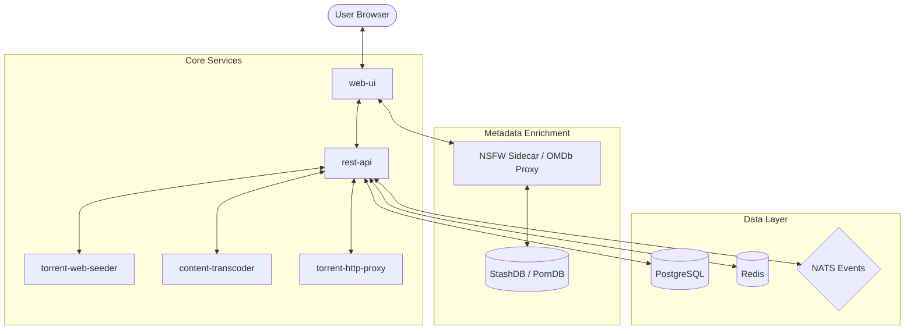

# 🚀 Octor: Bleeding-Edge Self-Hosted Webtor with NSFW Sidecar

This document outlines the architecture and implementation strategy for building a custom, self-hosted Webtor instance using the latest source code and a specialized NSFW metadata sidecar.

## 🏗 System Architecture

The system follows a microservice-oriented design where the `web-ui` acts as the orchestrator and primary interface, communicating with a fleet of specialized Go-based services.



## 🛠 Component List (Local Repositories)

The following components have been cloned into the `octor` workspace:

1.  **web-ui**: The primary frontend.
2.  **rest-api**: The central orchestration backend.
3.  **torrent-web-seeder**: Handles the BitTorrent protocol and data streaming.
4.  **content-transcoder**: Provides real-time HLS transcoding.
5.  **torrent-http-proxy**: Manages HTTP access to torrent content.
6.  **magnet2torrent**: Converts Magnet links to `.torrent` files.
7.  **vault**: deduplicated storage layer.
8.  **abuse-store / claims-provider**: Security and rate-limiting modules.
9.  **srt2vtt**: Subtitle processing.
10. **Sidecar (Plugin)**: Your custom OMDb-compliant shell for NSFW metadata.

---

## 🔞 Sidecar Integration (NSFW Metadata)

The `web-ui` is designed to fetch metadata from OMDb. By pointing the OMDb client to your sidecar, you enable rich metadata for NSFW content without modifying the core Go source code.

### Configuration Injection
To activate the sidecar and its adult database backends, the containers must be started with the following environment variables:

#### For `web-ui`:
| Variable | Value | Description |
| :--- | :--- | :--- |
| `OMDB_API_HOST` | `nsfw-sidecar` | The hostname of your sidecar service. |
| `OMDB_API_PORT` | `8000` | The internal port (FastAPI default). |
| `OMDB_API_SECURE` | `false` | Disables HTTPS for local service communication. |
| `OMDB_API_KEY` | `any-key` | A placeholder key. |

#### For `nsfw-sidecar`:
| Variable | Description |
| :--- | :--- |
| `STASHDB_API_KEY` | Your API key for StashDB.org. |
| `STASHDB_ENDPOINT` | Optional custom StashDB endpoint. |
| `TPDB_API_KEY` | Your API key for ThePornDB.net. |
| `NSFW_DB_ENABLED` | Set to `true` to enable adult lookups (default: true). |
| `MATCH_THRESHOLD` | Fuzzy match sensitivity (default: 65.0). |

---

## 🚀 Recommended Deployment Route: Docker Compose

Since you are working with the "bleeding edge" and have a custom sidecar, a **Docker Compose** setup is the most efficient path.

### Example `docker-compose.yml` Structure

```yaml
services:
  web-ui:
    build: ./web-ui
    environment:
      - REST_API_SERVICE_HOST=rest-api
      - OMDB_API_HOST=nsfw-sidecar
      - OMDB_API_PORT=8080
      - OMDB_API_SECURE=false
    ports:
      - "8080:8080"

  nsfw-sidecar:
    image: your-sidecar-image
    # This service translates Webtor OMDb requests to StashDB/ThePornDB
    ports:
      - "8080"

  rest-api:
    build: ./rest-api
    # ... rest of services (seeder, transcoder, postgres, etc.)
```

## 📝 Next Steps
1. **Containerize the Sidecar**: Ensure your custom plugin has a Dockerfile.
2. **Harmonize the Network**: Connect all 20+ services to a single internal Docker network.
3. **Database Initialization**: Run the migrations found in the `migrations` folders of the respective repositories.
