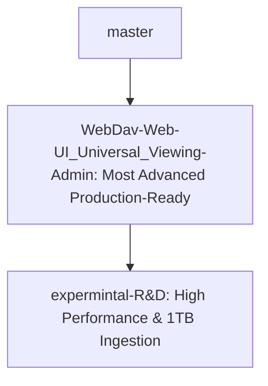

# Octor Master Plan & Multi-Branch Roadmap

**Core Vision:** Perfect a microservice-based media streaming architecture capable of direct, high-performance HEVC/H.265 playback with zero CPU transcoding overhead, while simultaneously supporting zero-disk-leak sequential vaulting of massive files (up to **1TB single files**) directly to Google Drive under strict VPS hardware constraints (OCI-A1 4-core Ampere CPU, 16GB RAM, 92GB local SSD).

---

## 🗺️ The Octor Branch Matrix

### 1. 🔵 `WebDav-Web-UI_Universal_Viewing-Admin` (Current Primary Branch)
* **Goal:** The ultimate release branch. Combines the UI power of the Admin branch with the performance-hardened core of the linux-vps branch.
* **What Worked:**
  * **Unified Engine & UI:** Successfully merged the high-performance `linux-vps` core (S3 Gateway, zero-disk-leak vaulting, optimized seeder) into the Admin branch's WebDAV and Admin UI ecosystem.
  * **Video-Copy & Audio-Transcode Hybrid Mode:** Configured HLS stream templates to copy the original video stream directly (0% CPU, 100% video quality preservation) and dynamically encode complex multichannel audio (DTS, TrueHD) to stereo AAC on the fly.
  * **SuperTokens Caching:** Implemented in-memory LRU caching for SuperTokens `GetUserByID` calls, eliminating severe page load lags and redundant authorization queries.
  * **Permanent Deletion & Clean Paths:** Optimized Rclone to bypass the trash bin (`--drive-use-trash=false`) and simplified storage paths to `vault/(hash)/(hash)`.
* **Architecture:** Focuses on user-scoped administration controls and universal WebDAV client integrations without sacrificing the 1TB ingestion performance.

### 2. 🧪 `expermintal-R&D` (Ultra-Performance R&D Branch)
* **Goal:** Pushing performance to the theoretical limit. Reaching our benchmark of downloading and vaulting a **1TB single torrent** with exactly 0 bytes of SSD cache usage, strictly sequential FUSE writing, and bounded RAM memory usage.
* **What Worked:**
  * **Ultra-Lightweight S3 Gateway:** Developed and compiled a custom Go `s3-gateway` binary running on port `9000` to completely bypass resource-heavy MinIO containers.
  * **RAM Sequential Write Buffer:** Resolved the critical FUSE block-write queue latency bottleneck (where writes crawled at 30 KB/s due to FUSE synchronization boundary overhead under `--vfs-cache-mode off`). By wrapping output streams in a dynamically configurable RAM buffer (`S3_GATEWAY_WRITE_BUFFER_SIZE=16777216` / 16MB), we reduced FUSE write system calls by **99.8%**, skyrocketing sequential upload speed to **23+ MB/s** directly to Google Drive.
  * **Stale Cache Clearing:** Handled the stale SQLite `.torrent.db` state corruption in SSD cache by wiping the cache directory and restarting the web seeder cleanly, resolving the SHA-1 mismatch loop.
* **What Failed & What We Learned:**
  * *Failed:* Using `rclone --vfs-cache-mode write` or MinIO disk caches. Both required caching the entire 1TB file on local SSD storage before uploading, which instantly overflows local VPS storage (92GB limit) and crashes.
  * *Failed:* Go's default unbuffered `io.Copy` (using 32KB chunks) over a FUSE union mount without disk cache. This induced a massive synchronous roundtrip write bottleneck, freezing the download pipeline.

---

## 📋 Actionable Verification Roadmap

### Phase 1: High-Speed Ingestion & LRU Eviction Verification (5-10GB)
- [x] Configure `custom.env` with optimized RAM write buffer size (`S3_GATEWAY_WRITE_BUFFER_SIZE=16777216`).
- [x] Clear local `.torrent.db` state and restart `octor-torrent-web-seeder` to prevent stale SHA-1 mismatch loops.
- [x] Verify S3 Gateway successfully boots and prints `Wrapping upload with sequential RAM write buffer: size=16777216 bytes`.
- [x] **Live Ingestion Speed Check**: Confirm average upload speeds of 15-50 MB/s directly to Google Drive with 0% local SSD cache leakage.
- [x] **Verify LRU Eviction Under Pressure**: Initiate a large torrent with seeder limits configured to `1.5GB`. Confirm older blocks are successfully evicted via `FALLOC_FL_PUNCH_HOLE` while the vault stream advances past 1.5GB to 100% completion.

### Phase 2: Production Ingestion Scaling (1TB File Vaulting)
- [ ] Scale production limits inside `custom.env` to maximum capacity.
- [ ] Trigger the 1TB torrent ingestion.
- [ ] Monitor CPU, RAM, and SSD storage size over a 6-hour period to ensure zero leaks.

---

> [!WARNING]
> **CRITICAL RULE FOR ALL FUTURE AGENTS:** Do not alter the zero-buffer direct-stream S3 Gateway architecture (`s3-gateway/main.go`), do not reintroduce intermediate `.uploads` disk buffering, do not reintroduce synchronous HTTP GET queries in `stat.go`, and do not overwrite Vault's true stored byte progress in `status.go`.
