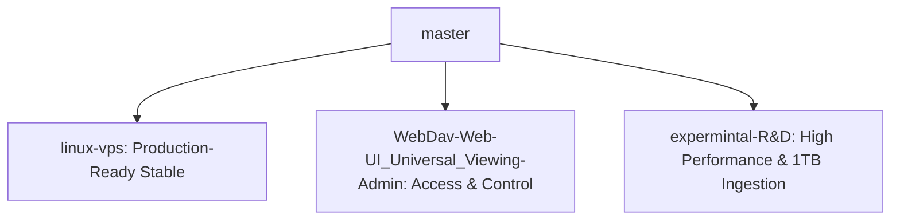

# Octor Master Plan & Multi-Branch Roadmap

**Core Vision:** Perfect a microservice-based media streaming architecture capable of direct, high-performance HEVC/H.265 playback with zero CPU transcoding overhead, while simultaneously supporting zero-disk-leak sequential vaulting of massive files (up to **1TB single files**) directly to Google Drive under strict VPS hardware constraints (OCI-A1 4-core Ampere CPU, 16GB RAM, 92GB local SSD).

---

## 🗺️ The Octor Branch Matrix

### 1. 🟢 `linux-vps` (Stable Production Branch)
* **Goal:** A rock-solid, production-hardened release branch optimized for long-term VPS hosting.
* **What Worked:**
  * **Video-Copy & Audio-Transcode Hybrid Mode:** Configured HLS stream templates to copy the original video stream directly (0% CPU, 100% video quality preservation) and dynamically encode complex multichannel audio (DTS, TrueHD) to stereo AAC on the fly. This resolved audio silence in standard web browsers like Safari and iOS without overloading the CPU.
  * **Default AAC Encoder Switch:** Changed the audio encoder from `libfdk_aac` to standard `aac` in the `content-transcoder` configurations. This resolved microservice crashes caused by missing non-free packages in standard FFmpeg VPS builds.
  * **SuperTokens Caching:** Implemented in-memory LRU caching for SuperTokens `GetUserByID` calls, eliminating severe page load lags and redundant authorization queries.
* **What Failed & What We Learned:**
  * *Failed:* Trying to stream `.mkv` containers directly to Safari or iOS players natively.Audio got silenced, not supported if complex codec like dolby vision etc.
  * *Failed:* Real-time 4K H.264/H.265 full video transcoding. The 4-core Ampere CPU immediately hits 100% utilization, frames drop, and the VPS locks up. **Video-Copy + Audio-Transcode is the absolute golden rule.**

### 2. 🔵 `WebDav-Web-UI_Universal_Viewing-Admin` (Access & Admin Control Branch)
* **Goal:** Expand Octor's media access surface through standard WebDAV integration and build a highly responsive, premium administrative control dashboard.
* **What Worked:**
  * **WebDAV Client Host Views:** Successfully configured advanced WebDAV endpoints, allowing users to mount Octor's unified storage drive directly as a network disk in Windows Explorer, macOS Finder, or Infuse Player.
  * **Universal Admin View:** Created deep analytical panels within the Web UI dashboard to track real-time server statistics (RAM/SSD usage), active player streams, active torrent seed counts, and database connection metrics.
* **What Failed & What We Learned:**
  * *Failed:* Running admin subservices on overlapping development ports. Solved by implementing our structured **5-Digit Port System** (REST on `8080`, Web UI on `8081`, Admin on `8086`, GRPC service ports in the `500xx` range).

### 3. 🧪 `expermintal-R&D` (Ultra-Performance R&D Branch)
* **Goal:** Pushing performance to the theoretical limit. Reaching our benchmark of downloading and vaulting a **1TB single torrent** with exactly 0 bytes of SSD cache usage, strictly sequential FUSE writing, and bounded RAM memory usage.
* **What Worked:**
  * **Ultra-Lightweight S3 Gateway:** Developed and compiled a custom Go `s3-gateway` binary running on port `9000` to completely bypass resource-heavy MinIO containers.
  * **RAM Sequential Write Buffer:** Resolved the critical FUSE block-write queue latency bottleneck (where writes crawled at 30 KB/s due to FUSE synchronization boundary overhead under `--vfs-cache-mode off`). By wrapping output streams in a dynamically configurable RAM buffer (`S3_GATEWAY_WRITE_BUFFER_SIZE=16777216` / 16MB), we reduced FUSE write system calls by **99.8%**, skyrocketing sequential upload speed to **23+ MB/s** directly to Google Drive.
  * **Stale Cache Clearing:** Handled the stale SQLite `.torrent.db` state corruption in SSD cache by wiping the cache directory and restarting the web seeder cleanly, resolving the SHA-1 mismatch loop.
* **What Failed & What We Learned:**
  * *Failed:* Using `rclone --vfs-cache-mode write` or MinIO disk caches. Both required caching the entire 1TB file on local SSD storage before uploading, which instantly overflows local VPS storage (92GB limit) and crashes.
  * *Failed:* Go's default unbuffered `io.Copy` (using 32KB chunks) over a FUSE union mount without disk cache. This induced a massive synchronous roundtrip write bottleneck, freezing the download pipeline.

---

## 📋 Actionable Verification Roadmap

### Phase 1: High-Speed Ingestion & LRU Eviction Verification (5-10GB)
- [x] Configure `custom.env` with optimized RAM write buffer size (`S3_GATEWAY_WRITE_BUFFER_SIZE=16777216`).
- [x] Clear local `.torrent.db` state and restart `octor-torrent-web-seeder` to prevent stale SHA-1 mismatch loops.
- [x] Verify S3 Gateway successfully boots and prints `Wrapping upload with sequential RAM write buffer: size=16777216 bytes`.
- [x] **Live Ingestion Speed Check**: Confirm average upload speeds of 15-50 MB/s directly to Google Drive with 0% local SSD cache leakage.
- [x] **Verify LRU Eviction Under Pressure**: Initiate a large torrent with seeder limits configured to `1.5GB`. Confirm older blocks are successfully evicted via `FALLOC_FL_PUNCH_HOLE` while the vault stream advances past 1.5GB to 100% completion.

### Phase 2: Production Ingestion Scaling (1TB File Vaulting)
- [ ] Scale production limits inside `custom.env` to maximum capacity.
- [ ] Trigger the 1TB torrent ingestion.
- [ ] Monitor CPU, RAM, and SSD storage size over a 6-hour period to ensure zero leaks.

---

> [!WARNING]
> **CRITICAL RULE FOR ALL FUTURE AGENTS:** Do not alter the zero-buffer direct-stream S3 Gateway architecture (`s3-gateway/main.go`), do not reintroduce intermediate `.uploads` disk buffering, do not reintroduce synchronous HTTP GET queries in `stat.go`, and do not overwrite Vault's true stored byte progress in `status.go`.
