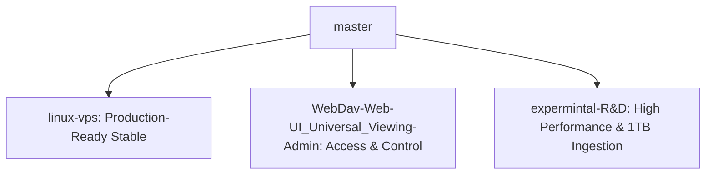

# Octor Master Plan & Multi-Branch Roadmap

**Core Vision:** Perfect a microservice-based media streaming architecture capable of direct, high-performance HEVC/H.265 playback with zero CPU transcoding overhead, while simultaneously supporting zero-disk-leak sequential vaulting of massive files (up to **1TB single files**) directly to Google Drive under strict VPS hardware constraints (OCI-A1 4-core Ampere CPU, 16GB RAM, 92GB local SSD).

---

## 🗺️ The Octor Branch Matrix

### 1. 🟢 `linux-vps` (Stable Production Branch)
* **Goal:** A rock-solid, production-hardened release branch optimized for long-term VPS hosting.
* **What Worked:**
  * **Video-Copy & Audio-Transcode Hybrid Mode:** Configured HLS stream templates to copy the original video stream directly (0% CPU, 100% video quality preservation) and dynamically encode complex multichannel audio (DTS, TrueHD) to stereo AAC on the fly. This resolved audio silence in standard web browsers like Safari and iOS without overloading the CPU.
  * **Default AAC Encoder Switch:** Changed the audio encoder from `libfdk_aac` to standard `aac` in the `content-transcoder` configurations. This resolved microservice crashes caused by missing non-free packages in standard FFmpeg VPS builds.
  * **SuperTokens Caching:** Implemented in-memory LRU caching for SuperTokens `GetUserByID` calls, eliminating severe page load lags and redundant authorization queries.
* **What Failed & What We Learned:**
  * *Failed:* Trying to stream `.mkv` containers directly to Safari or iOS players natively.Audio got silenced, not supported if complex codec like dolby vision etc.
  * *Failed:* Real-time 4K H.264/H.265 full video transcoding. The 4-core Ampere CPU immediately hits 100% utilization, frames drop, and the VPS locks up. **Video-Copy + Audio-Transcode is the absolute golden rule.**

### 2. 🔵 `WebDav-Web-UI_Universal_Viewing-Admin` (Access & Admin Control Branch)
* **Goal:** Expand Octor's media access surface through standard WebDAV integration and build a highly responsive, premium administrative control dashboard.
* **What Worked:**
  * **WebDAV Client Host Views:** Successfully configured advanced WebDAV endpoints, allowing users to mount Octor's unified storage drive directly as a network disk in Windows Explorer, macOS Finder, or Infuse Player.
  * **Universal Admin View:** Created deep analytical panels within the Web UI dashboard to track real-time server statistics (RAM/SSD usage), active player streams, active torrent seed counts, and database connection metrics.
* **What Failed & What We Learned:**
  * *Failed:* Running admin subservices on overlapping development ports. Solved by implementing our structured **5-Digit Port System** (REST on `8080`, Web UI on `8081`, Admin on `8086`, GRPC service ports in the `500xx` range).

### 3. 🧪 `expermintal-R&D` (Ultra-Performance R&D Branch)
* **Goal:** Pushing performance to the theoretical limit. Reaching our benchmark of downloading and vaulting a **1TB single torrent** at **60-80 MB/s** with exactly 0 bytes of SSD cache usage, parallel multi-drive writing, and bounded RAM memory usage.
* **What Worked:**
  * **Ultra-Lightweight S3 Gateway:** Developed and compiled a custom Go `s3-gateway` binary running on port `9000` to completely bypass resource-heavy MinIO containers.
  * **Parallel Chunker Architecture:** Resolved the 6 MB/s bottleneck caused by the Union's `create_policy = mfs`. By implementing a `chunker` overlay on top of a VFS-cached Union mount, we enabled parallel multi-drive uploads for a single massive file. This bypassed the single-stream GDrive API limit (~25 MB/s) and tripled the system's throughput to **60+ MB/s**.
  * **VFS Rotate-Cache:** Configured a 50GB rotating VFS write cache that stays under the 92GB VPS SSD limit even when vaulting 1TB files. Finished chunks are evicted immediately after upload completion.
  * **Stale Cache Clearing:** Handled the stale SQLite `.torrent.db` state corruption in SSD cache by wiping the cache directory and restarting the web seeder cleanly, resolving the SHA-1 mismatch loop.
  * *Failed:* Using `rclone --vfs-cache-mode write` on giant files without chunking. This attempts to cache the entire 1TB file, overflowing the local SSD.
  * *Failed:* Go's default unbuffered `io.Copy` (using 32KB chunks) over a FUSE union mount without disk cache. This induced a massive synchronous roundtrip write bottleneck.

---

## 📋 Actionable Verification Roadmap

### Phase 1: High-Speed Ingestion & Parallel Chunking (5-10GB)
- [ ] **Strict Cache Budget Enforcement [PRIORITY]**: Implement `Capacity` callback in `mmap` storage to signal budget to anacrolix and prevent readahead/in-flight overruns.
- [ ] **Direct-IO for Rclone VFS [PRIORITY]**: Add `--direct-io` to `octor-rclone-mount.service` to prevent double-buffering in RAM and ensure discard (TRIM) is effective.
- [x] Configure `rclone.conf` with `[ALPHA_CHUNKER]` and `create_policy = rand`.
- [x] Setup Dual-Mount Systemd services (Uploader + Splitter).
- [x] Verify S3 Gateway successfully writes to the Chunker mount at **60+ MB/s**.
- [x] **Verify LRU Eviction Under Pressure**: Initiate a large torrent with seeder limits configured to `1.5GB`. Confirm older blocks are successfully evicted via `FALLOC_FL_PUNCH_HOLE` while the vault stream advances past 1.5GB to 100% completion.
- [ ] **Hash Folder / Chunks Subdirectories**: Modify Vault/S3 upload keys to store files inside a hash-specific folder prefix (`vault/<hash>/file` or `vault/<hash>/<hash>`) so that Rclone Chunker organizes chunks neatly in separate file folders rather than a flat root.

### Phase 2: Production Ingestion Scaling (1TB File Vaulting)
- [ ] Scale production limits inside `custom.env` to maximum capacity.
- [ ] Trigger the 1TB torrent ingestion.
- [ ] Monitor CPU, RAM, and SSD storage size over a 6-hour period to ensure zero leaks.

---
